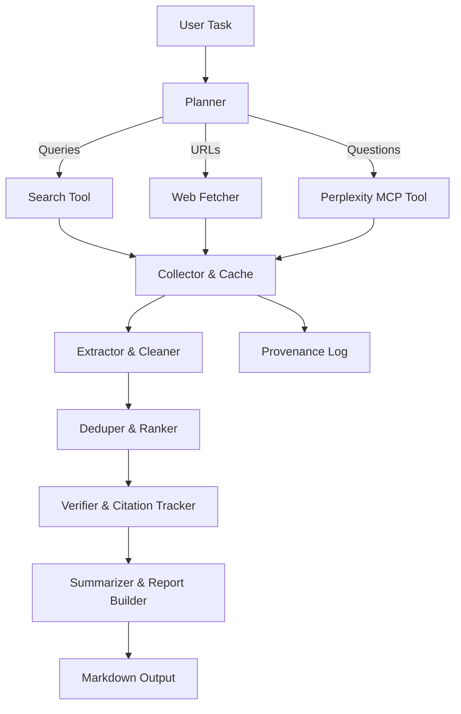

# Offline AI Agent — Internet Research Workflow (web / search APIs / Perplexity MCP)

> A ready-to-use, **Markdown** workflow example for a local/off‑line AI agent that orchestrates: a **web adapter**, **search APIs**, and a **Perplexity MCP** tool for evidence‑based Internet research.
> Includes architecture, code templates, prompts, and runbooks.

---

## Step 1 — Experts / Question / Plan (meta)

|Expert(s)|AI Research Engineer; Information Scientist; OSINT Analyst; Software Architect|
|:--|:--|
|Question|Design and deliver a reproducible, local/off‑line agent workflow that performs **Internet research** via a `web` adapter, generic **search tools**, and a **Perplexity MCP server**, producing **cited Markdown reports**.|
|Plan|Follow the 🧭 OSINT cycle (Direction→Collection→Processing→Analysis→Dissemination) with 🔁 CoVe (Chain‑of‑Verification) for reliability; implement a modular tool layer (Web, Search, MCP), evidence store with caching & dedup, and a summarizer that emits Markdown + citations.|

---

## 📌 Overview

This workflow turns a **local agent** into a disciplined **researcher**. It composes three interchangeable tooling paths:

- **Web adapter** for direct page retrieval (HTTP + content extraction).
- **Search tool** for SERP discovery (e.g., Brave/SerpAPI/Custom Search).
- **Perplexity MCP** to query a tool‑exposed retrieval capability while keeping the agent itself local.

Along the way, it enforces **provenance, citations, deduplication, date‑aware ranking**, and a structured, **exportable Markdown report**.

Key ideas to explore:
- 🧩 [Model Context Protocol (MCP)](https://www.google.com/search?q=model+context+protocol+mcp+server+client+example)
- 🔎 [Perplexity MCP server](https://www.google.com/search?q=Perplexity+MCP+server+setup+tools)
- 🌐 [Retrieval‑Augmented Generation (RAG) best practices](https://www.google.com/search?q=RAG+best+practices+retrieval+augmented+generation)
- 🕵️ [OSINT cycle](https://www.google.com/search?q=OSINT+cycle+direction+collection+processing+analysis+dissemination)
- ✅ [Chain of Verification for LLMs](https://www.google.com/search?q=Chain+of+Verification+LLM+method)
- 🧪 [Near‑duplicate detection (SimHash/MinHash)](https://www.google.com/search?q=SimHash+near+duplicate+detection+text)
- 🧰 [Readability/main‑content extraction](https://www.google.com/search?q=Readability+algorithm+main+content+extraction)

---

## 🧱 Architecture



**Roles**

- **Planner**: decomposes the task into sub‑queries and chooses tools (PACE: Primary/Alternate/Contingency/Emergency).
- **Collector**: gathers results; stores raw + canonicalized text, metadata, fetch times, and hashes.
- **Extractor**: converts HTML→clean text; normalizes, segments, and annotates with language, charset, and date hints.
- **Deduper & Ranker**: de‑duplicates (SimHash/MinHash); ranks by date, authority, diversity, and topicality.
- **Verifier**: cross‑checks claims across ≥2 sources; flags conflicts; keeps citation map.
- **Summarizer**: produces conservative Markdown sections with inline citations and a references table.

---

## ⚙️ Tool Interfaces (Python)

> Minimal, concrete, and swappable. The agent stays local; tools can be remote.

```python
# tools.py
from __future__ import annotations
from dataclasses import dataclass
from typing import List, Optional, Dict, Any
import time, json, os, hashlib, pathlib, requests
from bs4 import BeautifulSoup

@dataclass
class SearchHit:
    title: str
    url: str
    snippet: str
    source: str
    score: float = 0.0

@dataclass
class Doc:
    url: str
    title: str
    text: str
    html_hash: str
    fetched_at: float
    source: str

class Cache:
    def __init__(self, root: str = ".cache"):
        self.root = pathlib.Path(root)
        self.root.mkdir(parents=True, exist_ok=True)

    def put(self, key: str, payload: Dict[str, Any]) -> None:
        (self.root / f"{key}.json").write_text(json.dumps(payload, ensure_ascii=False, indent=2))

    def get(self, key: str) -> Optional[Dict[str, Any]]:
        p = self.root / f"{key}.json"
        return json.loads(p.read_text()) if p.exists() else None

def _hash(s: str) -> str:
    return hashlib.sha256(s.encode("utf-8", errors="ignore")).hexdigest()

class WebTool:
    """Lightweight HTTP fetcher + readability-ish content extraction."""
    def __init__(self, cache: Cache | None = None, timeout: int = 20):
        self.cache = cache or Cache(".cache/web")
        self.timeout = timeout

    def fetch(self, url: str) -> Doc:
        key = _hash(url)
        cached = self.cache.get(key)
        if cached:
            return Doc(**cached)

        r = requests.get(url, timeout=self.timeout, headers={"User-Agent": "research-agent/0.1"})
        r.raise_for_status()
        html = r.text
        soup = BeautifulSoup(html, "html.parser")
        # crude main-content heuristic: drop nav/script/style, keep text-heavy nodes
        for tag in soup(["script", "style", "noscript"]):
            tag.decompose()
        title = (soup.title.string if soup.title else url).strip()
        text = " ".join(soup.get_text(separator=" ").split())[:1_000_000]
        payload = {
            "url": url, "title": title, "text": text,
            "html_hash": _hash(html), "fetched_at": time.time(), "source": "web"
        }
        self.cache.put(key, payload)
        return Doc(**payload)

class SearchTool:
    """Generic search adapter (e.g., Brave/SerpAPI/CustomSearch). Supply endpoint+key at runtime."""
    def __init__(self, endpoint: str, api_key: str, cache: Cache | None = None):
        self.endpoint = endpoint
        self.api_key = api_key
        self.cache = cache or Cache(".cache/search")

    def search(self, query: str, k: int = 10) -> List[SearchHit]:
        key = _hash(f"{query}|{k}|{self.endpoint}")
        cached = self.cache.get(key)
        if cached:
            return [SearchHit(**x) for x in cached["hits"]]

        # Example request shape (engine-specific; adapt fields as needed):
        r = requests.get(self.endpoint, params={"q": query, "count": k}, headers={"X-API-KEY": self.api_key}, timeout=20)
        r.raise_for_status()
        data = r.json()

        # Map engine JSON → List[SearchHit] (customize per engine)
        hits: List[SearchHit] = []
        for item in data.get("web", {}).get("results", []):   # Example: Brave style
            hits.append(SearchHit(
                title=item.get("title") or "",
                url=item.get("url") or "",
                snippet=item.get("description") or "",
                source="search"
            ))

        self.cache.put(key, {"hits": [h.__dict__ for h in hits]})
        return hits

class MCPTool:
    """Minimal JSON-RPC over WebSocket to an MCP server (e.g., Perplexity)."""
    def __init__(self, ws_url: str, tool_name: str = "web-search"):
        self.ws_url = ws_url
        self.tool_name = tool_name

    def ask(self, query: str, k: int = 8) -> List[SearchHit]:
        # Pseudocode stub to illustrate call shape.
        # Use a concrete MCP client or websockets to implement JSON-RPC:
        """
        import asyncio, websockets, json, uuid
        async with websockets.connect(self.ws_url) as ws:
            rid = str(uuid.uuid4())
            await ws.send(json.dumps({"jsonrpc":"2.0","id":rid,"method":"tools/call",
                                      "params":{"name": self.tool_name,
                                                "arguments":{"query": query, "k": k}}}))
            resp = json.loads(await ws.recv())
        """
        # Here we just return an empty list to keep the example runnable.
        return []
```

---

## 🧠 Orchestrator (Planner → Collect → Verify → Summarize)

```python
# agent.py
from __future__ import annotations
from typing import List, Dict
import re, math, time, os
from tools import WebTool, SearchTool, MCPTool, SearchHit, Doc, Cache

def plan_queries(task: str) -> List[str]:
    """Simple decomposition; enhance with templates or a local LLM if available."""
    seeds = [task]
    # naive expansions
    for kw in ["latest", "timeline", "pros and cons", "statistics", "FAQ"]:
        seeds.append(f"{task} {kw}")
    # dedupe while preserving order
    seen, planned = set(), []
    for q in seeds:
        if q not in seen:
            planned.append(q); seen.add(q)
    return planned[:6]

def rank_urls(hits: List[SearchHit]) -> List[SearchHit]:
    """Rank by heuristic: title/snippet signals + domain authority hints."""
    def score(h: SearchHit) -> float:
        s = 0.0
        if re.search(r"\bfaq|guide|explained|overview|official\b", h.title.lower() + " " + h.snippet.lower()):
            s += 0.6
        if re.search(r"\b\.gov|\.edu|about|docs?\b", h.url.lower()):
            s += 0.7
        s += max(0.0, 1.0 - 0.02 * len(h.url))  # shorter urls get a tiny boost
        return s
    for h in hits: h.score = score(h)
    return sorted(hits, key=lambda x: x.score, reverse=True)

def simhash(text: str) -> int:
    """Toy SimHash (for near-duplicate detection)."""
    import hashlib
    bits = [0]*64
    for token in re.findall(r"\w+", text.lower()):
        hv = int(hashlib.md5(token.encode()).hexdigest(), 16)
        for i in range(64):
            bits[i] += 1 if (hv >> i) & 1 else -1
    out = 0
    for i, b in enumerate(bits):
        if b > 0: out |= (1 << i)
    return out

def hamming(a: int, b: int) -> int:
    return (a ^ b).bit_count()

def collect(task: str, search: SearchTool, web: WebTool, mcp: MCPTool | None = None, k: int = 6) -> List[Doc]:
    queries = plan_queries(task)
    urls_unique = []
    for q in queries:
        hits = search.search(q, k=k)
        for h in rank_urls(hits):
            if h.url and h.url not in urls_unique:
                urls_unique.append(h.url)
    # Optionally enrich via MCP
    if mcp:
        mcp_hits = mcp.ask(task, k=k)
        for h in mcp_hits:
            if h.url and h.url not in urls_unique:
                urls_unique.append(h.url)

    docs: List[Doc] = []
    fingerprints = []
    for url in urls_unique[:k*2]:  # cap fetches
        try:
            d = web.fetch(url)
            fp = simhash(d.text[:100_000])
            # keep if sufficiently novel
            if all(hamming(fp, g) > 6 for g in fingerprints):
                docs.append(d); fingerprints.append(fp)
        except Exception as e:
            # log and continue
            pass
    return docs

def verify_and_cite(docs: List[Doc], claims: List[str]) -> Dict[str, List[str]]:
    """Map each claim to URLs that support it (very basic matcher)."""
    support: Dict[str, List[str]] = {c: [] for c in claims}
    for c in claims:
        terms = [t for t in re.findall(r"\w+", c.lower()) if len(t) >= 4]
        for d in docs:
            text = d.text.lower()
            if sum(1 for t in terms if t in text) >= max(2, math.ceil(len(terms)*0.4)):
                support[c].append(d.url)
    return support

def summarize_to_markdown(task: str, docs: List[Doc], support: Dict[str, List[str]]) -> str:
    # minimal conservative summary
    md = [f"# Research Report\n\n**Task:** {task}\n\n---\n"]
    md.append("## Key Findings\n")
    for i, (claim, urls) in enumerate(support.items(), 1):
        md.append(f"{i}. {claim}")
        if urls:
            cites = " ".join(f"[{j}]({u})" for j, u in enumerate(urls, 1))
            md.append(f"   \n   _Sources_: {cites}")
        md.append("")
    md.append("\n---\n## Sources\n")
    for i, d in enumerate(docs, 1):
        md.append(f"{i}. [{d.title}]({d.url}) — fetched {time.strftime('%Y-%m-%d', time.gmtime(d.fetched_at))}")
    return "\n".join(md)

if __name__ == "__main__":
    # Wire everything together (provide real endpoint+key for your search engine)
    search = SearchTool(endpoint=os.getenv("SEARCH_API_URL", "https://api.search.brave.com/res/v1/web/search"),
                        api_key=os.getenv("SEARCH_API_KEY", "REPLACE_ME"))
    web = WebTool()
    mcp = None  # or MCPTool(ws_url=os.getenv("MCP_WS_URL", "wss://mcp.perplexity.ai"))
    task = os.getenv("TASK", "Assess the latest developments in open protocol tooling for LLM agents (2024-2025).")
    docs = collect(task, search, web, mcp=mcp, k=6)
    claims = [
        "Open protocols are emerging to standardize tool calling for agents.",
        "Some MCP servers provide search/browse capabilities with citations."
    ]
    support = verify_and_cite(docs, claims)
    print(summarize_to_markdown(task, docs, support))
```

---

## 🧩 Perplexity MCP — Client Sketch (TypeScript)

> Example shows an MCP JSON‑RPC call shape. Use a real SDK or a WebSocket client; adjust method names per your MCP server.

```ts
// mcp-client.ts
// npm i ws uuid
import WebSocket from "ws";
import { v4 as uuidv4 } from "uuid";

type JsonRpc = { jsonrpc: "2.0"; id?: string; method?: string; params?: any; result?: any; error?: any; };

export async function mcpCall(wsUrl: string, toolName: string, args: any): Promise<any> {
  const ws = new WebSocket(wsUrl);
  await new Promise(r => ws.on("open", r));

  const id = uuidv4();
  const req: JsonRpc = { jsonrpc: "2.0", id, method: "tools/call", params: { name: toolName, arguments: args } };
  ws.send(JSON.stringify(req));

  const result = await new Promise<any>((resolve, reject) => {
    ws.on("message", (data) => {
      try {
        const msg: JsonRpc = JSON.parse(String(data));
        if (msg.id === id && msg.result) resolve(msg.result);
        if (msg.error) reject(new Error(JSON.stringify(msg.error)));
      } catch (e) { reject(e); }
    });
    ws.on("error", reject);
  });
  ws.close();
  return result;
}

// Usage example (node):
// const out = await mcpCall("wss://your-perplexity-mcp/ws", "web-search", { query: "site:gov renewable incentives", k: 8 });
// console.log(out);
```

---

## 🧰 YAML — Agent Config & Runbook

**`config.yaml`**

```yaml
agent:
  name: local-researcher
  pace:            # tool fallback strategy (Primary/Alternate/Contingency/Emergency)
    primary: search
    alternate: web
    contingency: mcp
  limits:
    max_fetches: 12
    max_chars_per_doc: 120000
  ranking:
    prefer_domains: [".gov", ".edu", "docs.", "about."]
    dedupe_hamming_threshold: 6

tools:
  web:
    timeout_sec: 20
    cache_dir: .cache/web
  search:
    endpoint: ${SEARCH_API_URL}
    api_key: ${SEARCH_API_KEY}
    cache_dir: .cache/search
  mcp:
    ws_url: ${MCP_WS_URL}
    tool_name: web-search

output:
  dir: out
  format: markdown
```

**`task.runbook.yaml`**

```yaml
task: "Evaluate EU AI Act timeline and key obligations for SMEs (focus 2024–2025)"
subqueries:
  - "EU AI Act timeline 2024 2025 official"
  - "EU AI Act SME obligations summary site:europa.eu"
  - "EU AI Act prohibited practices explained"
  - "EU AI Act conformity assessment checklist"
claims_template:
  - "The Act was formally adopted on [DATE], with phased applicability."
  - "SMEs have proportionate obligations and specific support measures."
  - "High-risk systems require risk management, data governance, and post-market monitoring."
verify:
  min_supporting_sources_per_claim: 2
export:
  path: out/eu-ai-act-report.md
```

---

## 🧪 Quality Guardrails

- **Provenance first**: every fact ties to ≥1 URL; key claims require ≥2.
- **Date‑aware ranking**: prefer sources with explicit publication/update dates.
- **Diversity**: mix official/primary, reputable news, and expert analyses.
- **Dedup/near‑dup**: SimHash/MinHash to curb echoing.
- **CoVe**: adversarially re‑ask, “what would falsify this claim?”; re‑search if needed.
- **Output discipline**: cautious wording; surface uncertainties and conflicts explicitly.

---

## 🧪 Minimal Prompt Templates

**Planner prompt**

```
You are a planning module. Decompose the user task into 3–6 search queries that maximize coverage and recency.
Prefer queries likely to yield primary sources and official pages. Output one query per line.
```

**Summarizer prompt**

```
Produce a conservative, cited Markdown summary. For each key claim, include inline URLs to at least two
supporting sources if available. Indicate any conflicts or uncertainties. Avoid speculation.
```

---

## ▶️ Example CLI harness

```bash
export SEARCH_API_URL="https://api.search.brave.com/res/v1/web/search"
export SEARCH_API_KEY="REPLACE_ME"
# export MCP_WS_URL="wss://your-perplexity-mcp/ws"  # optional

python3 agent.py > out/sample-report.md
```

---

## 🧾 Output Shape (Markdown)

```markdown
# Research Report

**Task:** Evaluate EU AI Act timeline and key obligations for SMEs (focus 2024–2025)

---
## Key Findings
1. The Act was formally adopted on [DATE], with phased applicability.
   _Sources_: [1](https://example.gov/ai-act) [2](https://example.eu/press-release)

2. SMEs have proportionate obligations and specific support measures.
   _Sources_: [1](https://example.eu/sme-factsheet) [2](https://example.org/analysis)

---
## Sources
1. [Official press release] — fetched 2025-03-22
2. [EU factsheet] — fetched 2025-03-22
...
```

---

## 🔐 Notes on Local/Offline Operation

- The **agent** runs locally and persists **cache** and **artifacts** to disk.
- Network access is **tool‑scoped** (Search/Web/MCP) rather than global; disable any tool to simulate full offline.
- Log: every retrieval includes URL, time, hash, and tool used for later audit.

---

## 🔍 Useful References (Google searches)

- 🧩 [Model Context Protocol examples](https://www.google.com/search?q=model+context+protocol+examples+typescript+python)
- 🔎 [Perplexity tools + MCP](https://www.google.com/search?q=Perplexity+MCP+tools+usage)
- 🌐 [RAG patterns for research agents](https://www.google.com/search?q=RAG+patterns+for+research+agents)
- 🕵️ [OSINT tradecraft checklists](https://www.google.com/search?q=OSINT+tradecraft+checklist+best+practices)
- 🧪 [SimHash vs MinHash for text](https://www.google.com/search?q=SimHash+vs+MinHash+text+deduplication)
- 🧰 [Readability libraries Python](https://www.google.com/search?q=python+readability+extract+main+content)

---

**End of file**.
